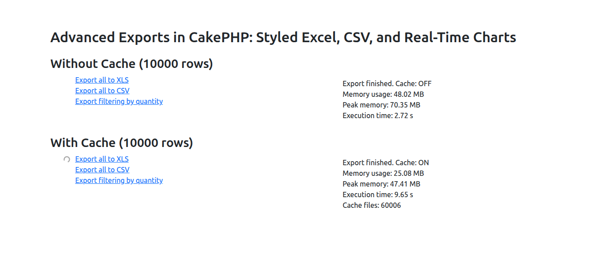
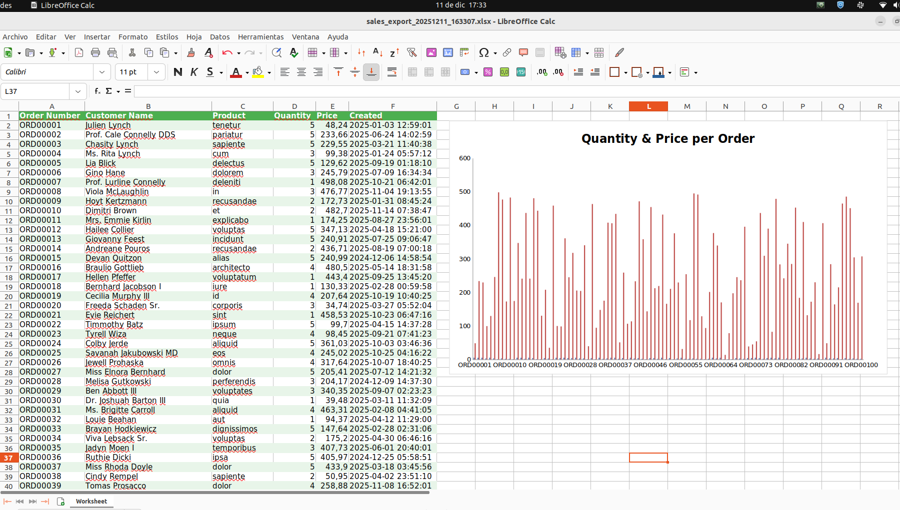

# Advanced Exports in CakePHP5: Styled Excel, CSV, and Real-Time Charts

### 1.- Requirements

Add with composer the phpoffice library

```
composer require "phpoffice/phpspreadsheet"
```

And another to fill a the sale table with 1000 rows

```
composer require "fakerphp/faker"
```

### 2.- Create sales table an fill with 10000 rows

**config/Migrations/20251201101023_CreateSales.php**

```
public function change(): void
    {
        $table = $this->table('sales');
        $table
            ->addColumn('order_number', 'string', ['limit' => 20])
            ->addColumn('customer_name', 'string', ['limit' => 50])
            ->addColumn('product', 'string', ['limit' => 50])
            ->addColumn('quantity', 'integer')
            ->addColumn('price', 'decimal', ['precision' => 10, 'scale' => 2])
            ->addColumn('created', 'datetime', ['default' => 'CURRENT_TIMESTAMP'])
            ->create();

        $faker = \Faker\Factory::create();

        $rows = [];
        for ($i = 0; $i < 10000; $i++) {
            $rows[] = [
                'order_number' => 'ORD' . str_pad((string)($i + 1), 5, '0', STR_PAD_LEFT),
                'customer_name' => $faker->name(),
                'product' => $faker->word(),
                'quantity' => rand(1, 5),
                'price' => $faker->randomFloat(2, 10, 500),
                'created' => $faker->dateTimeBetween('-1 year', 'now')->format('Y-m-d H:i:s'),
            ];
        }

        $this->table('sales')->insert($rows)->save();
    }
```

### 3.- Create a function called export

This function uses two services: one to fetch the data and another to generate the file that will be exported.

This function returns a JSON with the statistics.

Add to **config/routes.php**

```
$builder->connect('/export', ['controller' => 'Pages', 'action' => 'export']);
```

**src/Controller/PagesController.php**

```
public function export(): Response
{
// Measure start time and memory
$startTime = microtime(true);

        // Query params
        $format = $this->getRequest()->getQuery('format') ?? 'xlsx'; // 'csv' o 'xlsx'
        $filters['quantity'] = $this->getRequest()->getQuery('quantity');
        $cache = $this->getRequest()->getQuery('cache') != null;

        // Get data
        $service = new SalesService($filters);
        $sales = $service->getSales();

        // Create spreadsheet
        $service = new SpreadsheetService($cache);
        $filename = $service->generate($sales, $format);

        // Measure memory and final time
        $endTime = microtime(true);
        $endMem = memory_get_usage();
        $peakMem = memory_get_peak_usage();

        $cacheFiles = 0;
        if ($cache) {
            clearstatcache(true, TMP . 'cache/phpspreadsheet/');
            $cacheFiles = count(glob(TMP . 'cache/phpspreadsheet/*.cache'));
        }

        // Return JSON stats and filename
        $data = [
            'cache' => $cache ? 'ON' : 'OFF',
            'memory' => round($endMem/1024/1024,2),
            'peakMemory' => round($peakMem/1024/1024,2),
            'time' => round($endTime-$startTime,2),
            'cacheFiles' => $cacheFiles,
            'filename' => $filename
        ];

        $this->response = $this->response
            ->withType('application/json')
            ->withStringBody(json_encode($data));

        return $this->response;
    }
```

### 4.- Create a service to fetch the data from the table

**src/Service/SalesService.php**

```
<?php
declare(strict_types=1);

namespace App\Service;

use Cake\ORM\Table;
use Cake\ORM\TableRegistry;

class SalesService
{
    protected Table $salesTable;
    protected array $options = [];

    public function __construct(array $params)
    {
        $this->salesTable = TableRegistry::getTableLocator()->get('Sales');
        $this->options = $params;
    }

    /**
     * Retrieves sales grouped by product
     * The data is already cached by the finder
     *
     * @return array [['product' => 'Product A', 'total' => 10], ...]
     */
    public function getSales(): array
    {
        /** @uses \App\Model\Table\SalesTable::findSales() */
        return $this->salesTable->find('sales', $this->options)->toArray();
    }
}
```

### 5.- Create a finder in the Sales table that retrieves data based on the passed parameters

**src/Model/Table/SalesTable.php**

```
    public function findSales(Query $query, array $options): Query
    {
        $query->orderBy(['Sales.id' => 'ASC']);

        if ($options['quantity'] !== null) {
            $query->where(['Sales.quantity' => (int)$options['quantity']]);
        }

        return $query;
    }
```

### 6.- Create the service to generate the file

This service can receive in the constructor whether caching should be used or not.

This service generates, according to the format, a CSV or Excel file with styling, as well as a chart.

**src/Service/SpreadsheetService.php**

```
<?php
declare(strict_types=1);

namespace App\Service;

use App\Lib\BlockFileCache;
use Cake\ORM\Table;
use PhpOffice\PhpSpreadsheet\Chart\Chart;
use PhpOffice\PhpSpreadsheet\Chart\DataSeries;
use PhpOffice\PhpSpreadsheet\Chart\DataSeriesValues;
use PhpOffice\PhpSpreadsheet\Chart\PlotArea;
use PhpOffice\PhpSpreadsheet\Chart\Title;
use PhpOffice\PhpSpreadsheet\Settings;
use PhpOffice\PhpSpreadsheet\Spreadsheet;
use PhpOffice\PhpSpreadsheet\Style\Fill;
use PhpOffice\PhpSpreadsheet\Writer\Csv;
use PhpOffice\PhpSpreadsheet\Writer\Xlsx;

class SpreadsheetService
{
    public function __construct(bool $cache)
    {
        if ($cache) {
            $cachePath = TMP . 'cache' . DS . 'phpspreadsheet' . DS;
            $cache = new BlockFileCache($cachePath, 100);
            Settings::setCache($cache);
        }
    }

    public function generate(array $sales, $format)
    {
        // Create spreadsheet
        $spreadsheet = new Spreadsheet();
        $sheet = $spreadsheet->getActiveSheet();

        // Headers
        $headers = ['Order Number', 'Customer Name', 'Product', 'Quantity', 'Price', 'Created'];
        $sheet->fromArray($headers, null, 'A1');

        // Header styles
        $sheet->getStyle('A1:F1')->getFont()->setBold(true)->getColor()->setRGB('FFFFFF');
        $sheet->getStyle('A1:F1')->getFill()
            ->setFillType(Fill::FILL_SOLID)
            ->getStartColor()->setRGB('4CAF50');

        // Data with alternating rows
        $rowNum = 2;
        foreach ($sales as $sale) {
            $sheet->setCellValue("A{$rowNum}", $sale->order_number)
                ->setCellValue("B{$rowNum}", $sale->customer_name)
                ->setCellValue("C{$rowNum}", $sale->product)
                ->setCellValue("D{$rowNum}", $sale->quantity)
                ->setCellValue("E{$rowNum}", $sale->price)
                ->setCellValue("F{$rowNum}", $sale->created->format('Y-m-d H:i:s'));

            if ($rowNum % 2 === 0) {
                $sheet->getStyle("A{$rowNum}:F{$rowNum}")
                    ->getFill()
                    ->setFillType(Fill::FILL_SOLID)
                    ->getStartColor()->setRGB('E8F5E9');
            }
            $rowNum++;
        }

        // Graph
        $labels = [
            new DataSeriesValues('String', "Worksheet!A2:A10001", null, 100)
        ];

        $quantityValues = new DataSeriesValues('Number', "Worksheet!D2:D101", null, 100);
        $priceValues    = new DataSeriesValues('Number', "Worksheet!E2:E101", null, 100);

        $quantityName = new DataSeriesValues('String', "Worksheet!D1", null, 1);
        $priceName    = new DataSeriesValues('String', "Worksheet!E1", null, 1);

        $series = new DataSeries(
            DataSeries::TYPE_BARCHART,
            DataSeries::GROUPING_CLUSTERED,
            [0, 1],
            [$quantityName, $priceName],
            $labels,
            [$quantityValues, $priceValues]
        );

        $series->setPlotDirection(DataSeries::DIRECTION_COL);

        $plotArea = new PlotArea(null, [$series]);
        $title = new Title('Quantity & Price per Order');

        $chart = new Chart(
            'Sales Chart',
            $title,
            null,
            $plotArea
        );

        $chart->setTopLeftPosition('I2');
        $chart->setBottomRightPosition('U30');

        $sheet->addChart($chart);

        // Save file
        $filename = 'sales_export_' . date('Ymd_His') . '.' . $format;
        $tempPath = TMP . $filename;
        if ($format === 'csv') {
            $writer = new Csv($spreadsheet);
        } else {
            $writer = new Xlsx($spreadsheet);
            $writer->setIncludeCharts(true);
        }
        $writer->save($tempPath);

        return $filename;
    }
}
```

### 7.- Create a function for downloading the file

Add to **config/routes.php**

```
$builder->connect('/download', ['controller' => 'Pages', 'action' => 'download']);
```

**src/Controller/PagesController.php**

```
    public function download()
    {
        $filename = $this->getRequest()->getQuery('filename');
        $tempPath = TMP . $filename;
        if (!file_exists($tempPath)) {
            throw new NotFoundException("File not found");
        }

        $ext = pathinfo($tempPath, PATHINFO_EXTENSION);
        $type = $ext === 'csv'
            ? 'text/csv'
            : 'application/vnd.openxmlformats-officedocument.spreadsheetml.sheet';

        return $this->response
            ->withType($type)
            ->withDownload($filename)
            ->withFile($tempPath);
    }
```
### 8.- Create a class to use as cache

This class is based on **Psr\SimpleCache\CacheInterface**

Is used to write a file on disk in a minimum blockSize of 100, you can change by parameters, this affects memory and time

**src/Lib/BlockFileCache.php**

```
namespace App\Lib;

use Psr\SimpleCache\CacheInterface;

class BlockFileCache implements CacheInterface
{
    protected string $cacheDir;
    protected int $blockSize;

    public function __construct(string $cacheDir, int $blockSize = 100)
    {
        $this->cacheDir = rtrim($cacheDir, DIRECTORY_SEPARATOR) . DIRECTORY_SEPARATOR;
        $this->blockSize = $blockSize;

        if (!is_dir($this->cacheDir)) {
            mkdir($this->cacheDir, 0777, true);
        }
    }

    protected function getPath(string $key): string
    {
        return $this->cacheDir . md5($key) . '.cache';
    }

    public function get($key, $default = null): mixed
    {
        $file = $this->getPath($key);
        if (!file_exists($file)) {
            return $default;
        }
        $data = file_get_contents($file);
        return $data !== false ? unserialize($data) : $default;
    }

    public function set($key, $value, $ttl = null): bool
    {
        $file = $this->getPath($key);
        return file_put_contents($file, serialize($value)) !== false;
    }

    public function delete($key): bool
    {
        $file = $this->getPath($key);
        if (file_exists($file)) {
            unlink($file);
        }
        return true;
    }

    public function clear(): bool
    {
        $files = glob($this->cacheDir . '*.cache');
        foreach ($files as $file) {
            unlink($file);
        }
        return true;
    }

    public function getMultiple($keys, $default = null): iterable
    {
        $results = [];
        foreach ($keys as $key) {
            $results[$key] = $this->get($key, $default);
        }
        return $results;
    }

    public function setMultiple($values, $ttl = null): bool
    {
        foreach ($values as $key => $value) {
            $this->set($key, $value, $ttl);
        }
        return true;
    }

    public function deleteMultiple($keys): bool
    {
        foreach ($keys as $key) {
            $this->delete($key);
        }
        return true;
    }

    public function has($key): bool
    {
        return file_exists($this->getPath($key));
    }
}
```

# Frontend of the Application

**templates/Pages/exports.php**

- There are several calls to the export method to:
    - Export all
    - Export to CSV
    - Export applying a filter sent in the URL
- When clicking on a link, a request is made to generate the file in a temporary directory and return information about the process.
- Once the information is displayed on the right side, the file download is triggered.

The generated Excel sheet contains custom styles and a real-time chart calculated during the export using the functions provided by **phpoffice/phpspreadsheet**.



The displayed information relates to memory usage and execution time. Cache handling can be delegated and therefore separated from the business logic without issues.

For a large amount of data, it is necessary to use a cache implementation to reduce memory consumption. However, depending on the implementation, the processing time increases — for example, in this case, when using disk-based cache.




