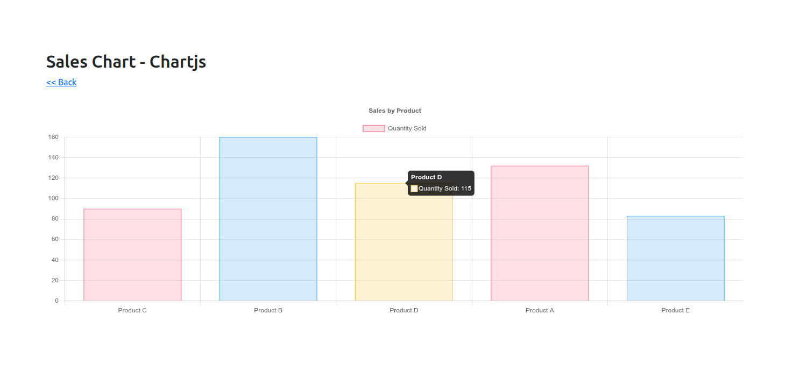
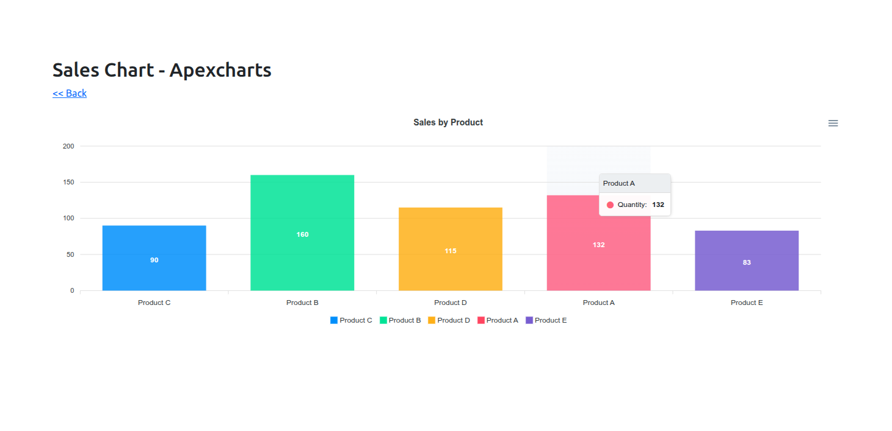
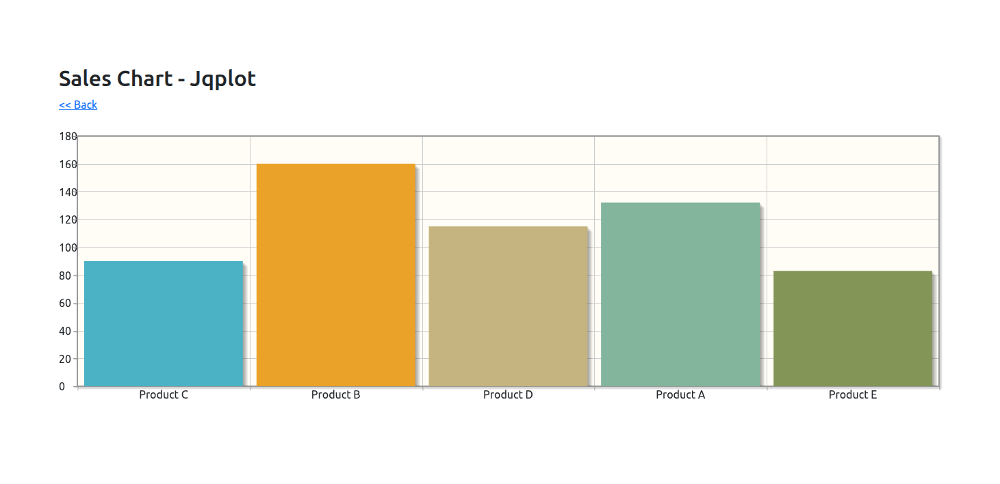

# Chart Generation in CakePHP 5 with Chart.js, ApexCharts, and jqPlot

### 1.- Requirements

To fill a the business table with data

```
composer require "fakerphp/faker"
```

### 2.- Create business table an fill with fake data

**config/Migrations/20251212105223_CreateBusiness.php**

```
    public function change(): void
    {
        $table = $this->table('business');
        $table->addColumn('product', 'string', ['limit' => 100])
            ->addColumn('quantity', 'integer')
            ->addColumn('date', 'date')
            ->addColumn('created', 'datetime', ['default' => 'CURRENT_TIMESTAMP'])
            ->addColumn('modified', 'datetime', ['default' => 'CURRENT_TIMESTAMP', 'update' => 'CURRENT_TIMESTAMP'])
            ->create();
    }
```

load a seed to fill it

```
bin/cake migrations seec --seed BusinessSeed
```

**config/Seeds/BusinessSeeder.php**

```
public function run(): void
{
    $faker = Faker::create();
    $data = [];

    $products = ['Product A', 'Product B', 'Product C', 'Product D', 'Product E'];

    for ($i = 0; $i < 50; $i++) {
        $data[] = [
            'product' => $faker->randomElement($products),
            'quantity' => $faker->numberBetween(1, 20),
            'date' => $faker->date(),
            'created' => date('Y-m-d H:i:s'),
            'modified' => date('Y-m-d H:i:s'),
        ];
    }

    $table = $this->table('business');
    $table->insert($data)->save();
}
```

## 3.- Create BusinessService to get the data

**src/Service/BusinessService.php**

```
<?php
declare(strict_types=1);

namespace App\Service;

use Cake\ORM\Table;
use Cake\ORM\TableRegistry;

class BusinessService
{
    protected Table $businessTable;

    public function __construct()
    {
        $this->businessTable = TableRegistry::getTableLocator()->get('Business');
    }

    /**
     * Retrieves sales grouped by product
     * The data is already cached by the finder
     *
     * @return array [['product' => 'Product A', 'total' => 10], ...]
     */
    public function getSalesByProduct(): array
    {
        return $this->businessTable->find('salesByProduct')
            ->enableHydration(false)
            ->toArray();
    }
}
```

## 4.- In BusinessTable create the finder to return data

**src/Model/Table/BusinessTable.php**

```
public function findSalesByProduct(Query $query, array $options): Query
{
    return $query
        ->select(['product', 'total' => 'SUM(quantity)'])
        ->groupBy('product');
}
```

## 5.- Create chartData action to return JSON data formatted

This function applies the appropriate formatter depending on the chart type passed as a parameter.

We cass **apexcharts**, **jqplot** or by default use **chartjs**

**src/Controller/PagesController.php**

```
use App\Lib\Charts\ApexChartsFormatter;
use App\Lib\Charts\ChartJsFormatter;
use App\Lib\Charts\JqPlotFormatter;

...
...
...

public function chartData()
{
    $type = $this->getRequest()->getQuery('type');

    $chartData = [];
    if ($type !== null) {
        $service = new BusinessService();
        $data = $service->getSalesByProduct();

        $formatter = match (strtolower($type)) {
            'apexcharts' => new ApexChartsFormatter(),
            'jqplot' => new JqPlotFormatter(),
            default => new ChartJsFormatter(),
        };
        $chartData = $formatter->format($data);
    }

    $this->set(compact('chartData', 'type'));
}
```
## 6.- Formatters

### ApexCharts

**src/Lib/Charts/ApexChartsFormatter.php**

```
class ApexChartsFormatter implements ChartFormatterInterface
{
    public function format(array $sales): array
    {
        $labels = [];
        $series = [];
        foreach ($sales as $v) {
            $labels[] = $v['product'];
            $series[] = (int)$v['total'];
        }

        return [
            'labels' => $labels,
            'series' => $series
        ];
    }
}
```

### ChartJs

**src/Lib/Charts/ChartJsFormatter.php**

```
class ChartJsFormatter implements ChartFormatterInterface
{
    public function format(array $sales): array
    {
        $labels = [];
        $data = [];
        foreach ($sales as $v) {
            $labels[] = $v['product'];
            $data[] = (int)$v['total'];
        }

        return [
            'labels' => $labels,
            'datasets' => [
                [
                    'label' => 'Quantity Sold',
                    'data' => $data,
                    'backgroundColor' => ['rgba(255,99,132,0.2)','rgba(54,162,235,0.2)','rgba(255,206,86,0.2)'],
                    'borderColor' => ['rgba(255,99,132,1)','rgba(54,162,235,1)','rgba(255,206,86,1)'],
                    'borderWidth' => 1
                ]
            ]
        ];
    }
}
```

### JqPlot

**src/Lib/Charts/JqPlotFormatter.php**

```
class JqPlotFormatter implements ChartFormatterInterface
{
    public function format(array $sales): array
    {
        $chartData = [];
        foreach ($sales as $v) {
            $chartData[] = [$v['product'], (int)$v['total']];
        }

        return $chartData;
    }
}
```

## 6.- Front

On the front we load only the chart required using his renderer class associated

**templates/Pages/chart_data.php**

```
<h2><?= __('Sales Chart');?></h2>
<div class="mb-4">
    <a href="/pages/charts"><< Back</a>
</div>
<!-- Containers -->
<canvas id="chartjsContainer" style="width:100%; height:400px; display:none;"></canvas>
<div id="apexContainer" style="width:100%; height:400px; display:none;"></div>
<div id="jqplotContainer" style="width:100%; height:400px; display:none;"></div>

<!-- Required libraries -->
<?php
echo $this->Html->script([
    'https://cdn.jsdelivr.net/npm/chart.js',
    'https://cdn.jsdelivr.net/npm/apexcharts',
    'https://code.jquery.com/jquery-3.6.0.min.js',
    'https://cdnjs.cloudflare.com/ajax/libs/jqPlot/1.0.9/jquery.jqplot.min.js',
    'https://cdnjs.cloudflare.com/ajax/libs/jqPlot/1.0.9/plugins/jqplot.barRenderer.min.js',
    'https://cdnjs.cloudflare.com/ajax/libs/jqPlot/1.0.9/plugins/jqplot.categoryAxisRenderer.min.js'
], ['block' => true]);
?>

<script>
    const type = '<?= $type ?>';
    const chartData = <?= json_encode($chartData) ?>;

    const containerIds = {
        chartjs: 'chartjsContainer',
        apexcharts: 'apexContainer',
        jqplot: 'jqplotContainer'
    };
    document.getElementById(containerIds[type]).style.display = 'block';

    const paths = {
        chartjs: '/js/chartsRenderers/ChartJsRenderer.js',
        apexcharts: '/js/chartsRenderers/ApexChartsRenderer.js',
        jqplot: '/js/chartsRenderers/JqPlotRenderer.js'
    };

    const classes = {
        chartjs: 'ChartJsRenderer',
        apexcharts: 'ApexChartsRenderer',
        jqplot: 'JqPlotRenderer'
    };

    // Dynamically load the corresponding JS class
    if(paths[type]) {
        const script = document.createElement('script');
        script.src = paths[type];
        script.onload = () => {
            const RendererClass = window[classes[type]];
            if(RendererClass) {
                const chart = new RendererClass(chartData, containerIds[type]);
                chart.render();
            } else {
                console.error('Class not found for type:', type);
            }
        };
        document.head.appendChild(script);
    } else {
        console.error('Unsupported chart type:', type);
    }
</script>
```

### ChartJsRenderer.js

**webroot/js/chartsRenderers/ChartJsRenderer.js**

```
class ChartJsRenderer {
    constructor(data, containerId) {
        this.data = data;
        this.containerId = containerId;
    }

    render() {
        const canvas = document.getElementById(this.containerId);
        if(!canvas || canvas.tagName.toLowerCase() !== 'canvas') {
            console.error('The container must be a canvas for Chart.js');
            return;
        }
        const ctx = canvas.getContext('2d');
        new Chart(ctx, {
            type: 'bar',
            data: this.data,
            options: {
                responsive: true,
                plugins: {
                    legend: { display: true },
                    title: { display: true, text: 'Sales by Product' }
                },
                scales: { y: { beginAtZero: true } }
            }
        });
    }
}

window.ChartJsRenderer = ChartJsRenderer;
```

### ApexChartsRenderer.js

**webroot/js/chartsRenderers/ApexChartsRenderer.js**

```
class ApexChartsRenderer {
    constructor(data, containerId) {
        this.data = data;
        this.containerId = containerId;
    }

    render() {
        new ApexCharts(document.querySelector(`#${this.containerId}`), {
            chart: { type: 'bar', height: 350 },
            series: [{ name: 'Quantity', data: this.data.series }],
            xaxis: { categories: this.data.labels },
            plotOptions: { bar: { distributed: true } },
            title: { text: 'Sales by Product', align: 'center' }
        }).render();
    }
}

window.ApexChartsRenderer = ApexChartsRenderer;
```

### JqPlotRenderer.js

**webroot/js/chartsRenderers/JqPlotRenderer.js**

```
class JqPlotRenderer {
    constructor(data, containerId) {
        this.data = data;
        this.containerId = containerId;
    }

    render() {
        $(function(){
            $.jqplot(this.containerId, [this.data], {
                seriesDefaults: {
                    renderer: $.jqplot.BarRenderer,
                    rendererOptions: { varyBarColor: true },
                    pointLabels: { show: true }
                },
                axes: {
                    xaxis: { renderer: $.jqplot.CategoryAxisRenderer },
                    yaxis: { min: 0 }
                }
            });
        }.bind(this));
    }
}

window.JqPlotRenderer = JqPlotRenderer;
```

With this approach, we separate the model logic from the view logic.

Additionally, it allows us to switch from one library to another, or to extend and add a new charting library, with minimal changes to the existing code.






